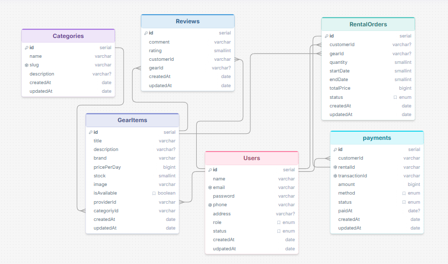

## Backend project: GearUp

GearUp is a modern gear rental management system that allows users to rent equipment online with secure Stripe payments, while providing admins with tools to manage gear, categories, rentals, and users.

---

## ERD DIAGRAM:

[ERD Link](https://drawsql.app/teams/mehediweb01/diagrams/assignment-4-gearup-ph)

---

## DB SCHEMA:

- category schema
- gearItems schema
- payment schema
- rentalOrder schema
- review schema
- user schema

---

## API ENDPOINT:

| Method | Endpoint                 | Description                                |
| ------ | ------------------------ | ------------------------------------------ |
| POST   | `/api/auth/register`     | Register a new user (CUSTOMER or PROVIDER) |
| POST   | `/api/auth/login`        | Login user and return access token         |
| GET    | `/api/auth/me`           | get my details                             |
| GET    | `/api/users`             | Get all users (ADMIN)                      |
| PATCH  | `/api/users/:id`         | update user status (ADMIN)                 |
| GET    | `/api/gear`              | Get all gear items                         |
| GET    | `/api/gear/:id`          | Get single gear details                    |
| POST   | `/api/gear/add`          | Create a new gear (Provider)               |
| PATCH  | `/api/gear/:id`          | Update gear (Provider)                     |
| DELETE | `/api/gear/:id`          | Delete gear (Provider)                     |
| POST   | `/api/rentals/create`    | Create a rental order (customer)           |
| GET    | `/api/rentals`           | Get rental history (customer)              |
| GET    | `/api/rentals/:id`       | Get single rental details (customer)       |
| PATCH  | `/api/rentals/:id`       | update order status (provider)             |
| GET    | `/api/rentals/provider`  | get incoming orders (provider)             |
| GET    | `/api/rentals/admin`     | get all orders (Admin)                     |
| POST   | `/api/payments/checkout` | Create Stripe checkout session (customer)  |
| POST   | `/api/payments/webhook`  | Handle Stripe webhook events               |
| GET    | `/api/payments`          | Get user payment history (customer)        |
| GET    | `/api/payments/:id`      | Get payment details (customer)             |
| POST   | `/api/reviews`           | Create a review (customer)                 |
| GET    | `/api/category`          | get all categories (public)                |
| POST   | `/api/category/create`   | Create a category (Admin)                  |

---

## Features:

- JWT Authentication & Authorization
- Role-based Access Control (Admin, Provider, Customer)
- Gear & Category Management
- Rental Order Management
- Stripe Payment Integration
- Payment Webhooks
- Review & Rating System
- Prisma ORM with PostgreSQL
- Global Error Handling
- Not Found handling
- Input Validation

---

## Folder Structure:

src
├── config
├── middlewares
├── modules
│ ├── auth
│ ├── category
│ ├── gear
│ ├── payment
│ ├── rental
│ ├── review
│ └── user
├── utils
├── lib
├── app.ts
└── server.ts

---

### Contact Me:

- Email: mehedihasan87456@gmail.com
- WhatsApp: +8801576794817
- [GitHub](https://github.com/mehediweb01)
- [LinkedIn](https://www.linkedin.com/in/mehediweb01/)

---

### Thank you

### Best Regards:  

Md. Mehedi Hasan
